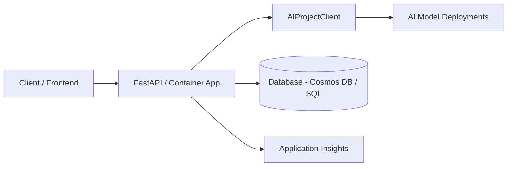

# API Backend Pattern

## When to Use
User wants: REST API, microservice, backend service, data processing API, integration endpoint — with AI capabilities.

## Architecture



## Azure Services Required

| Service | Purpose | Module |
|---------|---------|--------|
| Azure AI Foundry | AI Services + Project + Models | `core/host/ai-environment.bicep` |
| Azure Container Apps | Host the API | `core/host/container-apps.bicep` |
| Cosmos DB or Azure SQL | Data persistence (optional) | `modules/cosmos-db.bicep` or `modules/sql.bicep` |
| Application Insights | Monitoring | (bundled in ai-environment) |
| Container Registry | Docker images | (bundled in container-apps) |

**Note:** No Key Vault needed for most API backends — use Managed Identity for all service auth.

## App Code Structure (Python)

```
src/
├── api/
│   ├── __init__.py
│   ├── main.py                 # FastAPI app factory + lifespan
│   ├── routes.py               # Domain-specific API routes
│   ├── util.py                 # Logger, models
│   └── services/
│       ├── __init__.py
│       └── db_service.py       # Database operations (if needed)
├── Dockerfile
├── requirements.txt
├── gunicorn.conf.py
└── __init__.py
```

## Key Code Patterns

### App factory with AI client (`api/main.py`)

```python
import contextlib
import os
from typing import Union
from urllib.parse import urlparse

import fastapi
from azure.ai.projects.aio import AIProjectClient
from azure.ai.inference.aio import ChatCompletionsClient
from azure.identity import AzureDeveloperCliCredential, ManagedIdentityCredential
from dotenv import load_dotenv

@contextlib.asynccontextmanager
async def lifespan(app: fastapi.FastAPI):
    if not os.getenv("RUNNING_IN_PRODUCTION"):
        tenant_id = os.getenv("AZURE_TENANT_ID")
        azure_credential = AzureDeveloperCliCredential(tenant_id=tenant_id) if tenant_id else AzureDeveloperCliCredential()
    else:
        azure_credential = ManagedIdentityCredential(client_id=os.getenv("AZURE_CLIENT_ID"))

    endpoint = os.environ["AZURE_EXISTING_AIPROJECT_ENDPOINT"]
    project = AIProjectClient(credential=azure_credential, endpoint=endpoint)

    # Derive inference endpoint
    inference_endpoint = f"https://{urlparse(endpoint).netloc}/models"

    chat = ChatCompletionsClient(
        endpoint=inference_endpoint,
        credential=azure_credential,
        credential_scopes=["https://ai.azure.com/.default"],
    )

    app.state.chat = chat
    app.state.chat_model = os.environ["AZURE_AI_CHAT_DEPLOYMENT_NAME"]
    app.state.project = project
    yield

    await project.close()
    await chat.close()


def create_app():
    if not os.getenv("RUNNING_IN_PRODUCTION"):
        load_dotenv(override=True)

    app = fastapi.FastAPI(title="API Backend", version="1.0.0")

    from . import routes
    app.include_router(routes.router)
    return app
```

### Domain routes (`api/routes.py`)

```python
import fastapi
from fastapi import Request, Depends
from azure.ai.inference.aio import ChatCompletionsClient
from .util import ProcessRequest, ProcessResponse

router = fastapi.APIRouter()

def get_chat_client(request: Request) -> ChatCompletionsClient:
    return request.app.state.chat

def get_chat_model(request: Request) -> str:
    return request.app.state.chat_model

@router.post("/api/process", response_model=ProcessResponse)
async def process(
    request: ProcessRequest,
    chat_client: ChatCompletionsClient = Depends(get_chat_client),
    model: str = Depends(get_chat_model),
):
    """Process input using AI model."""
    response = await chat_client.complete(
        model=model,
        messages=[
            {"role": "system", "content": "You are a helpful API assistant."},
            {"role": "user", "content": request.input},
        ],
    )
    return ProcessResponse(
        result=response.choices[0].message.content,
        model=model,
    )

@router.get("/health")
async def health():
    return {"status": "healthy"}
```

### Database service with Cosmos DB (`api/services/db_service.py`)

```python
import os
from azure.identity.aio import DefaultAzureCredential
from azure.cosmos.aio import CosmosClient

class DatabaseService:
    def __init__(self):
        self.endpoint = os.environ["AZURE_COSMOS_ENDPOINT"]
        self.database_name = os.environ.get("AZURE_COSMOS_DATABASE", "appdb")
        self.container_name = os.environ.get("AZURE_COSMOS_CONTAINER", "items")

    async def _get_container(self):
        credential = DefaultAzureCredential()
        client = CosmosClient(url=self.endpoint, credential=credential)
        database = client.get_database_client(self.database_name)
        return database.get_container_client(self.container_name)

    async def create_item(self, item: dict) -> dict:
        container = await self._get_container()
        return await container.create_item(body=item)

    async def get_item(self, item_id: str, partition_key: str) -> dict:
        container = await self._get_container()
        return await container.read_item(item=item_id, partition_key=partition_key)

    async def query_items(self, query: str, parameters: list = None) -> list:
        container = await self._get_container()
        items = []
        async for item in container.query_items(query=query, parameters=parameters):
            items.append(item)
        return items
```

### Gunicorn config

```python
import os

max_requests = 1000
max_requests_jitter = 50
log_file = "-"
bind = "0.0.0.0:50505"

if not os.getenv("RUNNING_IN_PRODUCTION"):
    reload = True
```

### Dockerfile

```dockerfile
FROM python:3.13-slim-bookworm
WORKDIR /code
COPY . .
RUN pip install --no-cache-dir --upgrade pip && pip install --no-cache-dir -r requirements.txt
EXPOSE 50505
CMD ["gunicorn", "api.main:create_app"]
```

### requirements.txt

```
fastapi>=0.121.0
uvicorn[standard]>=0.29.0
gunicorn>=23.0.0
azure-identity>=1.19.0
azure-ai-projects>=1.0.0
azure-ai-inference>=1.0.0
azure-cosmos>=4.7.0
azure-core>=1.34.0
azure-monitor-opentelemetry>=1.6.0
pydantic>=2.8.0
python-dotenv
```

### Environment variables

| Variable | Source | Purpose |
|----------|--------|---------|
| `AZURE_CLIENT_ID` | Managed identity | Auth in production |
| `AZURE_EXISTING_AIPROJECT_ENDPOINT` | AI Project endpoint | Connect to Foundry |
| `AZURE_AI_CHAT_DEPLOYMENT_NAME` | Bicep param | Model name |
| `AZURE_COSMOS_ENDPOINT` | Cosmos DB output | Database (if used) |
| `RUNNING_IN_PRODUCTION` | `'true'` | Switch credential type |

## azure.yaml for this pattern

```yaml
name: <project-slug>
metadata:
  template: <project-slug>@1.0.0

requiredVersions:
  azd: ">=1.18.0"

hooks:
  preup:
    posix:
      shell: sh
      run: chmod u+r+x ./scripts/validate_env_vars.sh 2>/dev/null || true; ./scripts/validate_env_vars.sh
      interactive: true
      continueOnError: false
    windows:
      shell: pwsh
      run: ./scripts/validate_env_vars.ps1
      interactive: true
      continueOnError: false
  postdeploy:
    posix:
      shell: sh
      run: chmod u+r+x ./scripts/postdeploy.sh 2>/dev/null || true; ./scripts/postdeploy.sh
      interactive: true
      continueOnError: true
    windows:
      shell: pwsh
      run: ./scripts/postdeploy.ps1
      interactive: true
      continueOnError: true

services:
  api:
    project: ./src
    language: py
    host: containerapp
    docker:
      image: api
      remoteBuild: true

pipeline:
  variables:
    - AZURE_RESOURCE_GROUP
    - AZURE_EXISTING_AIPROJECT_RESOURCE_ID
    - AZURE_AI_CHAT_DEPLOYMENT_NAME
```

## Bicep Specifics

The `infra/main.bicep` for an API backend MUST create:
1. Resource group
2. AI Foundry environment (via `core/host/ai-environment.bicep`): Storage + Monitoring + AI Services + Project + Model deployments
3. Container Apps Environment + Container App + Container Registry
4. Cosmos DB account + database + container (optional — only if data persistence needed)
5. User-assigned managed identity for the Container App
6. Role assignments for BOTH user AND backend identity:
   - `Azure AI Developer` (64702f94)
   - `Cognitive Services User` (a97b65f3)
   - Cosmos DB data plane role (if database used)
7. Support "bring your own existing project" via `azureExistingAIProjectResourceId`
