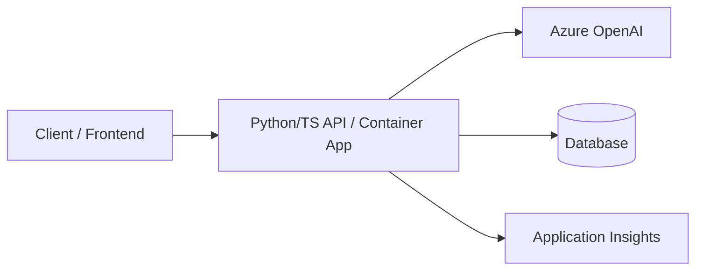

# API Backend Pattern

## When to Use
User wants: REST API, microservice, backend service, data processing API, integration endpoint — with AI capabilities.

## Architecture



## Azure Services Required

| Service | Purpose | Bicep Module |
|---------|---------|-------------|
| Azure Container Apps | Host the API | `modules/container-apps.bicep` |
| Azure OpenAI | AI capabilities | `modules/openai.bicep` |
| Cosmos DB or Azure SQL | Data persistence | `modules/cosmos-db.bicep` or `modules/sql.bicep` |
| Application Insights | Monitoring | `modules/monitoring.bicep` |
| Container Registry | Docker images | `modules/container-registry.bicep` |
| Key Vault | Secrets | `modules/keyvault.bicep` |

## App Code Structure (Python)

```
src/
├── api/
│   ├── __init__.py
│   ├── app.py                  # FastAPI application
│   ├── config.py               # Environment configuration
│   ├── routes/
│   │   ├── __init__.py
│   │   ├── health.py           # Health check
│   │   └── <domain>.py         # Domain-specific routes
│   ├── services/
│   │   ├── __init__.py
│   │   ├── openai_service.py   # AI integration
│   │   └── db_service.py       # Database operations
│   └── models/
│       ├── __init__.py
│       └── <domain>.py         # Pydantic models
├── Dockerfile
├── requirements.txt
└── gunicorn.conf.py
```

## Key Code Patterns

### FastAPI app (`app.py`)
```python
from fastapi import FastAPI
from fastapi.middleware.cors import CORSMiddleware
from azure.monitor.opentelemetry import configure_azure_monitor
from config import settings
from routes import health, domain_router

if settings.applicationinsights_connection_string:
    configure_azure_monitor(connection_string=settings.applicationinsights_connection_string)

app = FastAPI(title=settings.app_name, version="1.0.0")

app.add_middleware(
    CORSMiddleware,
    allow_origins=["*"],
    allow_methods=["*"],
    allow_headers=["*"],
)

app.include_router(health.router)
app.include_router(domain_router.router, prefix="/api")
```

### Database service with Cosmos DB (`services/db_service.py`)
```python
from azure.identity import DefaultAzureCredential
from azure.cosmos.aio import CosmosClient
from config import settings

credential = DefaultAzureCredential()

class DatabaseService:
    def __init__(self):
        self.client = CosmosClient(
            url=settings.cosmos_endpoint,
            credential=credential,
        )
        self.database = self.client.get_database_client(settings.cosmos_database)
        self.container = self.database.get_container_client(settings.cosmos_container)
    
    async def create_item(self, item: dict) -> dict:
        return await self.container.create_item(body=item)
    
    async def get_item(self, item_id: str, partition_key: str) -> dict:
        return await self.container.read_item(item=item_id, partition_key=partition_key)
    
    async def query_items(self, query: str, parameters: list = None) -> list:
        items = []
        async for item in self.container.query_items(query=query, parameters=parameters):
            items.append(item)
        return items
```

## requirements.txt
```
fastapi>=0.115.0
uvicorn>=0.30.0
azure-identity>=1.17.0
openai>=1.40.0
azure-cosmos>=4.7.0
azure-monitor-opentelemetry>=1.6.0
gunicorn>=22.0.0
pydantic>=2.8.0
```

## azure.yaml for this pattern
```yaml
name: <project-slug>
metadata:
  template: <project-slug>@1.0.0

hooks:
  preprovision:
    posix:
      shell: sh
      run: chmod +x ./scripts/preprovision.sh && ./scripts/preprovision.sh
      interactive: true
      continueOnError: false
    windows:
      shell: pwsh
      run: ./scripts/preprovision.ps1
      interactive: true
      continueOnError: false
  postprovision:
    posix:
      shell: sh
      run: chmod +x ./scripts/postprovision.sh && ./scripts/postprovision.sh
      interactive: true
      continueOnError: true
    windows:
      shell: pwsh
      run: ./scripts/postprovision.ps1
      interactive: true
      continueOnError: true

services:
  api:
    project: ./src
    language: py
    host: containerapp
    docker:
      image: api
      remoteBuild: true
```

## Bicep Specifics

The `infra/main.bicep` for an API backend MUST create:
1. Resource group
2. Container Apps Environment + Container App
3. Container Registry
4. Azure OpenAI with model deployment
5. Cosmos DB account + database + container (or Azure SQL if relational data)
6. Application Insights + Log Analytics
7. Key Vault
8. Managed Identity with:
    - `Cognitive Services OpenAI User` on OpenAI
    - Role on database (Cosmos DB: custom data plane role; SQL: db_datareader/writer)
