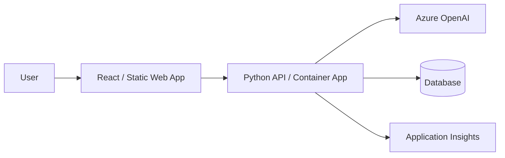

# Full-Stack Web App Pattern

## When to Use
User wants: web application with UI, dashboard, portal, admin panel, interactive app — with AI features.

## Architecture



## Azure Services Required

| Service | Purpose | Bicep Module |
|---------|---------|-------------|
| Azure Container Apps | Host the backend API | `modules/container-apps.bicep` |
| Azure Static Web Apps | Host the React frontend | `modules/static-web-app.bicep` |
| Azure OpenAI | AI features | `modules/openai.bicep` |
| Cosmos DB | Data persistence | `modules/cosmos-db.bicep` |
| Application Insights | Monitoring | `modules/monitoring.bicep` |
| Container Registry | Backend images | `modules/container-registry.bicep` |
| Key Vault | Secrets | `modules/keyvault.bicep` |

## App Code Structure

```
src/
├── api/
│   ├── __init__.py
│   ├── app.py
│   ├── config.py
│   ├── routes/
│   │   ├── __init__.py
│   │   ├── health.py
│   │   └── <domain>.py
│   ├── services/
│   └── models/
├── frontend/
│   ├── src/
│   │   ├── App.tsx
│   │   ├── main.tsx
│   │   ├── components/
│   │   │   ├── ChatPanel.tsx
│   │   │   ├── Header.tsx
│   │   │   └── Layout.tsx
│   │   ├── hooks/
│   │   │   └── useChat.ts
│   │   ├── api/
│   │   │   └── client.ts
│   │   └── types/
│   │       └── index.ts
│   ├── index.html
│   ├── package.json
│   ├── tsconfig.json
│   └── vite.config.ts
├── Dockerfile                  # Backend only
└── requirements.txt
```

## Key Frontend Patterns

### API client (`frontend/src/api/client.ts`)
```typescript
const API_BASE = import.meta.env.VITE_API_URL || "";

export interface ChatMessage {
  role: "user" | "assistant";
  content: string;
}

export interface ChatResponse {
  message: string;
  citations?: { title: string; url: string }[];
}

export async function sendMessage(message: string, history: ChatMessage[]): Promise<ChatResponse> {
  const response = await fetch(`${API_BASE}/api/chat`, {
    method: "POST",
    headers: { "Content-Type": "application/json" },
    body: JSON.stringify({ message, history }),
  });
  
  if (!response.ok) {
    throw new Error(`API error: ${response.status}`);
  }
  
  return response.json();
}
```

### Chat component (`frontend/src/components/ChatPanel.tsx`)
```tsx
import { useState } from "react";
import { sendMessage, ChatMessage } from "../api/client";

export function ChatPanel() {
  const [messages, setMessages] = useState<ChatMessage[]>([]);
  const [input, setInput] = useState("");
  const [loading, setLoading] = useState(false);

  const handleSend = async () => {
    if (!input.trim() || loading) return;
    
    const userMessage: ChatMessage = { role: "user", content: input };
    setMessages((prev) => [...prev, userMessage]);
    setInput("");
    setLoading(true);

    try {
      const response = await sendMessage(input, messages);
      setMessages((prev) => [...prev, { role: "assistant", content: response.message }]);
    } catch (error) {
      console.error("Chat error:", error);
    } finally {
      setLoading(false);
    }
  };

  return (
    <div className="chat-panel">
      <div className="messages">
        {messages.map((msg, i) => (
          <div key={i} className={`message ${msg.role}`}>{msg.content}</div>
        ))}
      </div>
      <div className="input-area">
        <input value={input} onChange={(e) => setInput(e.target.value)} onKeyDown={(e) => e.key === "Enter" && handleSend()} placeholder="Type a message..." />
        <button onClick={handleSend} disabled={loading}>Send</button>
      </div>
    </div>
  );
}
```

### package.json
```json
{
  "name": "frontend",
  "private": true,
  "version": "1.0.0",
  "type": "module",
  "scripts": {
    "dev": "vite",
    "build": "tsc && vite build",
    "preview": "vite preview"
  },
  "dependencies": {
    "react": "^18.3.0",
    "react-dom": "^18.3.0"
  },
  "devDependencies": {
    "@types/react": "^18.3.0",
    "@types/react-dom": "^18.3.0",
    "@vitejs/plugin-react": "^4.3.0",
    "typescript": "^5.5.0",
    "vite": "^5.4.0"
  }
}
```

## azure.yaml for this pattern
```yaml
name: <project-slug>
metadata:
  template: <project-slug>@1.0.0

hooks:
  preprovision:
    posix:
      shell: sh
      run: chmod +x ./scripts/preprovision.sh && ./scripts/preprovision.sh
      interactive: true
      continueOnError: false
    windows:
      shell: pwsh
      run: ./scripts/preprovision.ps1
      interactive: true
      continueOnError: false
  postprovision:
    posix:
      shell: sh
      run: chmod +x ./scripts/postprovision.sh && ./scripts/postprovision.sh
      interactive: true
      continueOnError: true
    windows:
      shell: pwsh
      run: ./scripts/postprovision.ps1
      interactive: true
      continueOnError: true

services:
  api:
    project: ./src/api
    language: py
    host: containerapp
    docker:
      image: api
      remoteBuild: true
  frontend:
    project: ./src/frontend
    language: js
    host: staticwebapp
```

## Bicep Specifics

The `infra/main.bicep` for a full-stack app MUST create:
1. Resource group
2. Container Apps Environment + Container App (API)
3. Static Web App (frontend)
4. Container Registry
5. Azure OpenAI with model deployment
6. Cosmos DB (or chosen database)
7. Application Insights + Log Analytics
8. Key Vault
9. Managed Identity with appropriate roles
