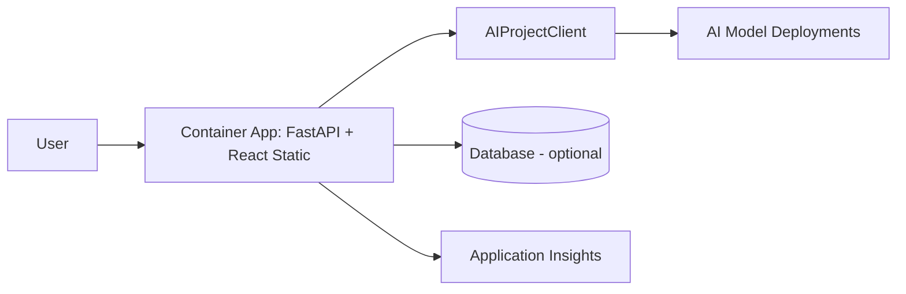
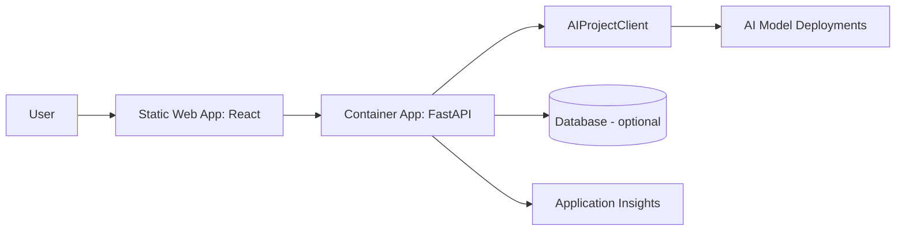

# Full-Stack Web App Pattern

## When to Use
User wants: web application with UI, dashboard, portal, admin panel, interactive app — with AI features.

## Architecture

There are two deployment options for full-stack apps:

### Option A: Single Container (Frontend bundled in backend) — RECOMMENDED


### Option B: Separate Services (Frontend in Static Web App)


**When to choose:**
- **Option A** — simpler, single deployment, frontend built during Docker build, served via FastAPI StaticFiles. Recommended for most templates.
- **Option B** — when frontend needs its own scaling, CDN, or custom domain separate from API.

## Azure Services Required

| Service | Purpose | Module |
|---------|---------|--------|
| Azure AI Foundry | AI Services + Project + Models | `core/host/ai-environment.bicep` |
| Azure Container Apps | Host the API (+ frontend in Option A) | `core/host/container-apps.bicep` |
| Azure Static Web Apps | Host frontend (Option B only) | `modules/static-web-app.bicep` |
| Cosmos DB | Data persistence (optional) | `modules/cosmos-db.bicep` |
| Application Insights | Monitoring | (bundled in ai-environment) |
| Container Registry | Docker images | (bundled in container-apps) |

## App Code Structure

### Option A: Bundled (single container)
```
src/
├── api/
│   ├── __init__.py
│   ├── main.py                 # FastAPI app factory + lifespan + StaticFiles mount
│   ├── routes.py               # API routes + HTML template serving
│   ├── util.py                 # Logger, request models
│   ├── static/                 # Built React assets (populated by Docker build)
│   └── templates/              # Jinja2 HTML shell (index.html)
├── frontend/
│   ├── src/
│   │   ├── App.tsx
│   │   ├── main.tsx
│   │   ├── components/
│   │   │   ├── ChatPanel.tsx
│   │   │   ├── Header.tsx
│   │   │   └── Layout.tsx
│   │   ├── hooks/
│   │   │   └── useChat.ts
│   │   └── api/
│   │       └── client.ts
│   ├── index.html
│   ├── package.json
│   ├── tsconfig.json
│   └── vite.config.ts
├── Dockerfile                  # Builds frontend + backend together
├── requirements.txt
├── gunicorn.conf.py
└── __init__.py
```

### Option B: Separate services
```
src/
├── api/                        # Same as above but no static/templates
│   ├── __init__.py
│   ├── main.py
│   ├── routes.py
│   └── ...
├── frontend/                   # Deployed separately to Static Web App
│   ├── src/
│   ├── package.json
│   └── staticwebapp.config.json
├── Dockerfile                  # Backend only
└── requirements.txt
```

## Key Code Patterns

### App factory serving static frontend (`api/main.py` — Option A)

```python
import contextlib
import os
from typing import Union
from urllib.parse import urlparse

import fastapi
from azure.ai.projects.aio import AIProjectClient
from azure.ai.inference.aio import ChatCompletionsClient
from azure.identity import AzureDeveloperCliCredential, ManagedIdentityCredential
from dotenv import load_dotenv
from fastapi.staticfiles import StaticFiles
from fastapi.templating import Jinja2Templates

@contextlib.asynccontextmanager
async def lifespan(app: fastapi.FastAPI):
    if not os.getenv("RUNNING_IN_PRODUCTION"):
        tenant_id = os.getenv("AZURE_TENANT_ID")
        azure_credential = AzureDeveloperCliCredential(tenant_id=tenant_id) if tenant_id else AzureDeveloperCliCredential()
    else:
        azure_credential = ManagedIdentityCredential(client_id=os.getenv("AZURE_CLIENT_ID"))

    endpoint = os.environ["AZURE_EXISTING_AIPROJECT_ENDPOINT"]
    inference_endpoint = f"https://{urlparse(endpoint).netloc}/models"

    chat = ChatCompletionsClient(
        endpoint=inference_endpoint,
        credential=azure_credential,
        credential_scopes=["https://ai.azure.com/.default"],
    )

    app.state.chat = chat
    app.state.chat_model = os.environ["AZURE_AI_CHAT_DEPLOYMENT_NAME"]
    yield
    await chat.close()


def create_app():
    if not os.getenv("RUNNING_IN_PRODUCTION"):
        load_dotenv(override=True)

    app = fastapi.FastAPI(lifespan=lifespan)

    # Serve built React frontend as static files
    app.mount("/static", StaticFiles(directory="api/static"), name="static")

    from . import routes
    app.include_router(routes.router)
    return app
```

### Frontend API client (`frontend/src/api/client.ts`)

```typescript
const API_BASE = import.meta.env.VITE_API_URL || "";

export interface ChatMessage {
  role: "user" | "assistant";
  content: string;
}

export async function sendMessage(
  messages: ChatMessage[],
  onChunk: (content: string) => void
): Promise<void> {
  const response = await fetch(`${API_BASE}/chat`, {
    method: "POST",
    headers: { "Content-Type": "application/json" },
    body: JSON.stringify({ messages }),
  });

  if (!response.ok) throw new Error(`API error: ${response.status}`);

  const reader = response.body!.getReader();
  const decoder = new TextDecoder();

  while (true) {
    const { done, value } = await reader.read();
    if (done) break;

    const text = decoder.decode(value);
    for (const line of text.split("\n")) {
      if (line.startsWith("data: ")) {
        const data = JSON.parse(line.slice(6));
        if (data.type === "message") {
          onChunk(data.content);
        }
      }
    }
  }
}
```

### Chat component (`frontend/src/components/ChatPanel.tsx`)

```tsx
import { useState, useCallback } from "react";
import { sendMessage, ChatMessage } from "../api/client";

export function ChatPanel() {
  const [messages, setMessages] = useState<ChatMessage[]>([]);
  const [input, setInput] = useState("");
  const [loading, setLoading] = useState(false);
  const [streamingContent, setStreamingContent] = useState("");

  const handleSend = useCallback(async () => {
    if (!input.trim() || loading) return;

    const userMessage: ChatMessage = { role: "user", content: input };
    const updatedMessages = [...messages, userMessage];
    setMessages(updatedMessages);
    setInput("");
    setLoading(true);
    setStreamingContent("");

    try {
      let accumulated = "";
      await sendMessage(updatedMessages, (chunk) => {
        accumulated += chunk;
        setStreamingContent(accumulated);
      });
      setMessages((prev) => [...prev, { role: "assistant", content: accumulated }]);
      setStreamingContent("");
    } catch (error) {
      console.error("Chat error:", error);
    } finally {
      setLoading(false);
    }
  }, [input, messages, loading]);

  return (
    <div className="chat-panel">
      <div className="messages">
        {messages.map((msg, i) => (
          <div key={i} className={`message ${msg.role}`}>{msg.content}</div>
        ))}
        {streamingContent && (
          <div className="message assistant streaming">{streamingContent}</div>
        )}
      </div>
      <div className="input-area">
        <input
          value={input}
          onChange={(e) => setInput(e.target.value)}
          onKeyDown={(e) => e.key === "Enter" && handleSend()}
          placeholder="Type a message..."
        />
        <button onClick={handleSend} disabled={loading}>Send</button>
      </div>
    </div>
  );
}
```

### package.json

```json
{
  "name": "frontend",
  "private": true,
  "version": "1.0.0",
  "type": "module",
  "scripts": {
    "dev": "vite",
    "build": "tsc && vite build",
    "preview": "vite preview"
  },
  "dependencies": {
    "react": "^18.3.0",
    "react-dom": "^18.3.0"
  },
  "devDependencies": {
    "@types/react": "^18.3.0",
    "@types/react-dom": "^18.3.0",
    "@vitejs/plugin-react": "^4.3.0",
    "typescript": "^5.5.0",
    "vite": "^5.4.0"
  }
}
```

### vite.config.ts

```typescript
import { defineConfig } from "vite";
import react from "@vitejs/plugin-react";

export default defineConfig({
  plugins: [react()],
  build: {
    outDir: "../api/static",
    emptyOutDir: true,
  },
  server: {
    proxy: {
      "/chat": "http://localhost:50505",
      "/health": "http://localhost:50505",
    },
  },
});
```

### Dockerfile (Option A: bundled)

```dockerfile
FROM python:3.13-slim-bookworm
WORKDIR /code
COPY . .

RUN pip install --no-cache-dir --upgrade pip && pip install --no-cache-dir -r requirements.txt

# Install Node.js and pnpm, build frontend into api/static/
RUN apt-get update && apt-get install -y curl \
    && curl -fsSL https://deb.nodesource.com/setup_22.x | bash - \
    && apt-get install -y nodejs && npm install -g pnpm@10.6.0

WORKDIR /code/frontend
RUN pnpm install --frozen-lockfile=false && pnpm build && rm -rf node_modules

WORKDIR /code
EXPOSE 50505
CMD ["gunicorn", "api.main:create_app"]
```

### Gunicorn config

```python
import os

max_requests = 1000
max_requests_jitter = 50
log_file = "-"
bind = "0.0.0.0:50505"

if not os.getenv("RUNNING_IN_PRODUCTION"):
    reload = True
```

### requirements.txt

```
fastapi>=0.121.0
uvicorn[standard]>=0.29.0
gunicorn>=23.0.0
azure-identity>=1.19.0
azure-ai-projects>=1.0.0
azure-ai-inference>=1.0.0
azure-core>=1.34.0
azure-monitor-opentelemetry>=1.6.0
jinja2
python-dotenv
```

## azure.yaml for this pattern

### Option A: Bundled (single service)
```yaml
name: <project-slug>
metadata:
  template: <project-slug>@1.0.0

requiredVersions:
  azd: ">=1.18.0"

hooks:
  preup:
    posix:
      shell: sh
      run: chmod u+r+x ./scripts/validate_env_vars.sh 2>/dev/null || true; ./scripts/validate_env_vars.sh
      interactive: true
      continueOnError: false
    windows:
      shell: pwsh
      run: ./scripts/validate_env_vars.ps1
      interactive: true
      continueOnError: false
  postdeploy:
    posix:
      shell: sh
      run: chmod u+r+x ./scripts/postdeploy.sh 2>/dev/null || true; ./scripts/postdeploy.sh
      interactive: true
      continueOnError: true
    windows:
      shell: pwsh
      run: ./scripts/postdeploy.ps1
      interactive: true
      continueOnError: true

services:
  api_and_frontend:
    project: ./src
    language: py
    host: containerapp
    docker:
      image: api_and_frontend
      remoteBuild: true

pipeline:
  variables:
    - AZURE_RESOURCE_GROUP
    - AZURE_EXISTING_AIPROJECT_RESOURCE_ID
    - AZURE_AI_CHAT_DEPLOYMENT_NAME
```

### Option B: Separate services
```yaml
name: <project-slug>
metadata:
  template: <project-slug>@1.0.0

requiredVersions:
  azd: ">=1.18.0"

hooks:
  preup:
    posix:
      shell: sh
      run: chmod u+r+x ./scripts/validate_env_vars.sh 2>/dev/null || true; ./scripts/validate_env_vars.sh
      interactive: true
      continueOnError: false
    windows:
      shell: pwsh
      run: ./scripts/validate_env_vars.ps1
      interactive: true
      continueOnError: false
  postdeploy:
    posix:
      shell: sh
      run: chmod u+r+x ./scripts/postdeploy.sh 2>/dev/null || true; ./scripts/postdeploy.sh
      interactive: true
      continueOnError: true
    windows:
      shell: pwsh
      run: ./scripts/postdeploy.ps1
      interactive: true
      continueOnError: true

services:
  api:
    project: ./src
    language: py
    host: containerapp
    docker:
      image: api
      remoteBuild: true
  frontend:
    project: ./src/frontend
    language: js
    host: staticwebapp
```

## Bicep Specifics

The `infra/main.bicep` for a full-stack app MUST create:
1. Resource group
2. AI Foundry environment (via `core/host/ai-environment.bicep`): Storage + Monitoring + AI Services + Project + Model deployments
3. Container Apps Environment + Container App + Container Registry
4. Static Web App (Option B only)
5. Cosmos DB (optional — if data persistence needed)
6. User-assigned managed identity for the Container App
7. Role assignments for BOTH user AND backend identity:
   - `Azure AI Developer` (64702f94)
   - `Cognitive Services User` (a97b65f3)
   - `Azure AI User` (53ca6127) — user only
   - Cosmos DB data plane role (if database used)
8. Support "bring your own existing project" via `azureExistingAIProjectResourceId`
