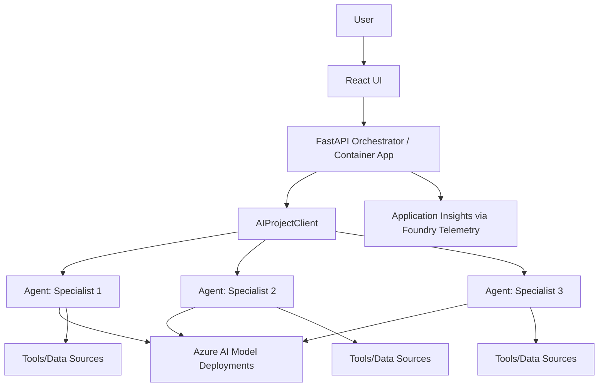

# Multi-Agent Pattern

## When to Use
User wants: multiple specialized AI agents, orchestration, agent coordination, complex AI workflows with multiple steps, Foundry Agent Service.

## Architecture



## Azure Services Required

| Service | Purpose | Module |
|---------|---------|--------|
| Azure AI Foundry | AI Services + Project + Agent Service | `core/host/ai-environment.bicep` |
| Azure Container Apps | Host orchestrator API + frontend | `core/host/container-apps.bicep` |
| Azure Blob Storage | Agent data + file storage | (bundled in ai-environment) |
| Application Insights | Tracing across agents | (bundled in ai-environment) |
| Container Registry | Docker images | (bundled in container-apps) |
| Log Analytics | Logs | (bundled in ai-environment) |

**Note:** No Key Vault needed. No standalone OpenAI resource — models are deployed via AI Services.

## App Code Structure (Python)

```
src/
├── api/
│   ├── __init__.py
│   ├── main.py                     # FastAPI app factory + lifespan
│   ├── routes.py                   # Chat endpoint (invokes agent)
│   ├── util.py                     # Logger, request models
│   ├── logging_config.py           # Structured logging setup
│   ├── static/                     # Built React frontend
│   └── templates/                  # Jinja2 shell
├── frontend/                       # React chat UI
│   ├── src/
│   ├── package.json
│   └── vite.config.ts
├── Dockerfile
├── requirements.txt
├── gunicorn.conf.py
└── __init__.py
```

## Key Code Patterns

### App factory with lifespan (`api/main.py`)

```python
import contextlib
import os

import fastapi
from azure.ai.projects.aio import AIProjectClient
from azure.ai.projects.telemetry import AIProjectInstrumentor
from azure.identity.aio import DefaultAzureCredential
from dotenv import load_dotenv
from fastapi.staticfiles import StaticFiles

enable_trace = False

@contextlib.asynccontextmanager
async def lifespan(app: fastapi.FastAPI):
    proj_endpoint = os.environ["AZURE_EXISTING_AIPROJECT_ENDPOINT"]
    agent_id = os.environ.get("AZURE_EXISTING_AGENT_ID")

    async with (
        DefaultAzureCredential() as credential,
        AIProjectClient(endpoint=proj_endpoint, credential=credential) as project_client,
    ):
        # Set up tracing if enabled
        if enable_trace:
            conn_string = await project_client.telemetry.get_application_insights_connection_string()
            if conn_string:
                from azure.monitor.opentelemetry import configure_azure_monitor
                configure_azure_monitor(connection_string=conn_string)
                AIProjectInstrumentor().instrument(True)

        # Get or create the agent
        if agent_id:
            agent = await project_client.agents.get_agent(agent_id)
        else:
            agent = await project_client.agents.create_agent(
                model=os.environ["AZURE_AI_CHAT_DEPLOYMENT_NAME"],
                name="orchestrator",
                instructions="You are a helpful orchestrator agent.",
            )

        app.state.project_client = project_client
        app.state.agent = agent
        yield


def create_app():
    if not os.getenv("RUNNING_IN_PRODUCTION"):
        load_dotenv(override=True)

    global enable_trace
    enable_trace = os.getenv("ENABLE_AZURE_MONITOR_TRACING", "").lower() == "true"

    app = fastapi.FastAPI(lifespan=lifespan)
    app.mount("/static", StaticFiles(directory="api/static"), name="static")

    from . import routes
    app.include_router(routes.router)
    return app
```

### Agent invocation (`api/routes.py`)

```python
import json
import fastapi
from fastapi import Request, Depends
from fastapi.responses import StreamingResponse
from azure.ai.projects.aio import AIProjectClient
from .util import ChatRequest

router = fastapi.APIRouter()

def get_project_client(request: Request) -> AIProjectClient:
    return request.app.state.project_client

def get_agent(request: Request):
    return request.app.state.agent

@router.post("/chat")
async def chat_handler(
    chat_request: ChatRequest,
    project_client: AIProjectClient = Depends(get_project_client),
    agent = Depends(get_agent),
) -> StreamingResponse:

    async def response_stream():
        # Create a thread for this conversation
        thread = await project_client.agents.create_thread()

        # Add user messages to thread
        for msg in chat_request.messages:
            await project_client.agents.create_message(
                thread_id=thread.id,
                role=msg.role,
                content=msg.content,
            )

        # Run the agent and stream response
        async with await project_client.agents.create_stream(
            thread_id=thread.id,
            agent_id=agent.id,
        ) as stream:
            async for event in stream:
                if hasattr(event, "text"):
                    yield f"data: {json.dumps({'content': event.text, 'type': 'message'})}\n\n"

        yield f"data: {json.dumps({'type': 'stream_end'})}\n\n"

    return StreamingResponse(response_stream(), headers={
        "Cache-Control": "no-cache",
        "Content-Type": "text/event-stream",
    })

@router.get("/health")
async def health():
    return {"status": "healthy"}
```

### Multi-agent orchestration pattern (when multiple specialized agents are needed)

```python
class AgentOrchestrator:
    """Routes requests to specialized agents based on intent."""

    def __init__(self, project_client: AIProjectClient, agents: dict):
        self.project_client = project_client
        self.agents = agents  # {"research": agent_id, "code": agent_id, ...}

    async def route_and_invoke(self, message: str, intent: str) -> str:
        agent_id = self.agents.get(intent, self.agents["default"])
        thread = await self.project_client.agents.create_thread()

        await self.project_client.agents.create_message(
            thread_id=thread.id, role="user", content=message
        )

        run = await self.project_client.agents.create_and_process_run(
            thread_id=thread.id, agent_id=agent_id
        )

        messages = await self.project_client.agents.list_messages(thread_id=thread.id)
        return messages.data[0].content[0].text.value
```

### Gunicorn config (`gunicorn.conf.py`)

```python
import os

max_requests = 1000
max_requests_jitter = 50
log_file = "-"
bind = "0.0.0.0:50505"

if not os.getenv("RUNNING_IN_PRODUCTION"):
    reload = True
```

### Dockerfile

```dockerfile
FROM python:3.13-slim-bookworm
WORKDIR /code
COPY . .

RUN pip install --no-cache-dir --upgrade pip && pip install --no-cache-dir -r requirements.txt

RUN apt-get update && apt-get install -y curl \
    && curl -fsSL https://deb.nodesource.com/setup_22.x | bash - \
    && apt-get install -y nodejs && npm install -g pnpm@10.6.0

WORKDIR /code/frontend
RUN pnpm install --frozen-lockfile=false && pnpm build && rm -rf node_modules

WORKDIR /code
EXPOSE 50505
CMD ["gunicorn", "api.main:create_app"]
```

### requirements.txt

```
fastapi>=0.121.0
uvicorn[standard]>=0.29.0
gunicorn>=23.0.0
azure-identity>=1.19.0
azure-ai-projects>=1.0.0
azure-ai-inference>=1.0.0
azure-core>=1.34.0
azure-core-tracing-opentelemetry
azure-monitor-opentelemetry>=1.6.0
opentelemetry-sdk
jinja2
python-dotenv
```

### Environment variables

| Variable | Source | Purpose |
|----------|--------|---------|
| `AZURE_CLIENT_ID` | Managed identity | Auth in production |
| `AZURE_EXISTING_AIPROJECT_ENDPOINT` | AI Project endpoint | Connect to Foundry |
| `AZURE_EXISTING_AGENT_ID` | Postdeploy script output | Pre-registered agent ID |
| `AZURE_AI_CHAT_DEPLOYMENT_NAME` | Bicep param | Model for agents |
| `RUNNING_IN_PRODUCTION` | `'true'` | Switch credential type |
| `ENABLE_AZURE_MONITOR_TRACING` | Bicep param | Enable tracing |

## azure.yaml for this pattern

```yaml
name: <project-slug>
metadata:
  template: <project-slug>@1.0.0

requiredVersions:
  azd: ">=1.18.0"

hooks:
  preup:
    posix:
      shell: sh
      run: chmod u+r+x ./scripts/validate_env_vars.sh 2>/dev/null || true; ./scripts/validate_env_vars.sh
      interactive: true
      continueOnError: false
    windows:
      shell: pwsh
      run: ./scripts/validate_env_vars.ps1
      interactive: true
      continueOnError: false
  postdeploy:
    posix:
      shell: sh
      run: chmod u+r+x ./scripts/postdeploy.sh 2>/dev/null || true; ./scripts/postdeploy.sh
      interactive: true
      continueOnError: true
    windows:
      shell: pwsh
      run: ./scripts/postdeploy.ps1
      interactive: true
      continueOnError: true

services:
  api_and_frontend:
    project: ./src
    language: py
    host: containerapp
    docker:
      image: api_and_frontend
      remoteBuild: true

pipeline:
  variables:
    - AZURE_RESOURCE_GROUP
    - AZURE_EXISTING_AIPROJECT_RESOURCE_ID
    - AZURE_AI_CHAT_DEPLOYMENT_NAME
    - AZURE_EXISTING_AGENT_ID
```

## Bicep Specifics

The `infra/main.bicep` for a multi-agent system MUST create:
1. Resource group
2. AI Foundry environment (via `core/host/ai-environment.bicep`): Storage + Monitoring + AI Services + Project + Connections + Model deployments
3. Container Apps Environment + Container App + Container Registry
4. User-assigned managed identity for the Container App
5. Role assignments for BOTH user AND backend identity:
   - `Azure AI Developer` (64702f94) — required for Agent Service API
   - `Cognitive Services User` (a97b65f3)
   - `Azure AI User` (53ca6127) — user only
6. AppInsights Monitoring Metrics Contributor scoped to backend identity
7. Support "bring your own existing project" via `azureExistingAIProjectResourceId`

## Postdeploy Script

1. Register agents with Foundry Agent Service (via `azure-ai-projects` SDK)
2. Upload any tool files (for file_search tool)
3. Store agent IDs in azd environment (`azd env set AZURE_EXISTING_AGENT_ID <id>`)
4. Print deployed app URL + Foundry project URL
