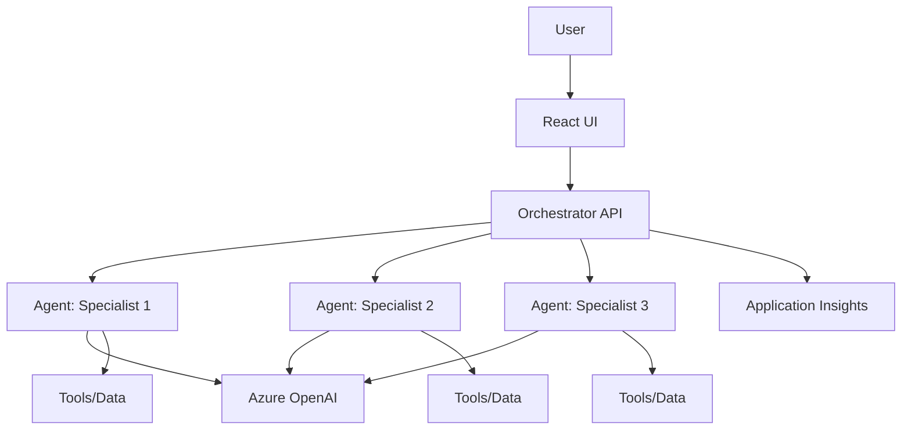

# Multi-Agent Pattern

## When to Use
User wants: multiple specialized AI agents, orchestration, agent coordination, complex AI workflows with multiple steps, Foundry Agent Service.

## Architecture



## Azure Services Required

| Service | Purpose | Bicep Module |
|---------|---------|-------------|
| Azure Container Apps | Host orchestrator + agents | `modules/container-apps.bicep` |
| Azure AI Foundry | Agent hosting + management | `modules/ai-foundry.bicep` |
| Azure OpenAI | LLM for all agents | `modules/openai.bicep` |
| Azure Blob Storage | Agent data storage | `modules/storage.bicep` |
| Application Insights | Tracing across agents | `modules/monitoring.bicep` |
| Container Registry | Docker images | `modules/container-registry.bicep` |
| Key Vault | Secrets | `modules/keyvault.bicep` |

## App Code Structure (Python)

```
src/
├── api/
│   ├── __init__.py
│   ├── app.py                      # FastAPI orchestrator
│   ├── config.py
│   ├── routes/
│   │   ├── __init__.py
│   │   ├── chat.py                 # User-facing chat endpoint
│   │   └── health.py
│   └── orchestrator/
│       ├── __init__.py
│       └── coordinator.py          # Routes requests to agents
├── agents/
│   ├── <agent-1>/
│   │   ├── agent.yaml              # Agent descriptor
│   │   ├── main.py                 # Agent logic
│   │   └── schemas.py             # Input/output schemas
│   ├── <agent-2>/
│   │   ├── agent.yaml
│   │   ├── main.py
│   │   └── schemas.py
│   └── <agent-3>/
│       ├── agent.yaml
│       ├── main.py
│       └── schemas.py
├── Dockerfile
├── requirements.txt
└── gunicorn.conf.py
```

## Key Code Patterns

### Orchestrator (`orchestrator/coordinator.py`)
```python
from azure.identity import DefaultAzureCredential
from azure.ai.projects import AIProjectClient
from config import settings

credential = DefaultAzureCredential()

class AgentCoordinator:
    def __init__(self):
        self.project_client = AIProjectClient(
            endpoint=settings.ai_project_endpoint,
            credential=credential,
        )
    
    async def process_request(self, user_message: str) -> dict:
        """Route request through appropriate agents."""
        # 1. Classify intent
        intent = await self._classify_intent(user_message)
        
        # 2. Route to appropriate agent(s)
        results = []
        for agent_name in intent["agents"]:
            result = await self._invoke_agent(agent_name, user_message)
            results.append(result)
        
        # 3. Synthesize response
        return await self._synthesize(results, user_message)
    
    async def _invoke_agent(self, agent_name: str, message: str) -> dict:
        """Call a specific agent via Foundry Agent Service."""
        agent = self.project_client.agents.get_agent(agent_name)
        thread = self.project_client.agents.create_thread()
        
        self.project_client.agents.create_message(
            thread_id=thread.id,
            role="user",
            content=message,
        )
        
        run = self.project_client.agents.create_and_process_run(
            thread_id=thread.id,
            agent_id=agent.id,
        )
        
        messages = self.project_client.agents.list_messages(thread_id=thread.id)
        return {"agent": agent_name, "response": messages.data[0].content[0].text.value}
```

### Agent descriptor (`agents/<name>/agent.yaml`)
```yaml
name: <agent-name>
description: >
  <What this agent does, what inputs it processes, what output it produces>
model: gpt-4o-mini
instructions: |
  You are a specialized agent for <domain>.
  Your role is to <specific task>.
  Always respond with structured output.
tools:
  - type: file_search
  - type: code_interpreter
```

## azure.yaml for this pattern
```yaml
name: <project-slug>
metadata:
  template: <project-slug>@1.0.0

hooks:
  preprovision:
    posix:
      shell: sh
      run: chmod +x ./scripts/preprovision.sh && ./scripts/preprovision.sh
      interactive: true
      continueOnError: false
    windows:
      shell: pwsh
      run: ./scripts/preprovision.ps1
      interactive: true
      continueOnError: false
  postprovision:
    posix:
      shell: sh
      run: chmod +x ./scripts/postprovision.sh && ./scripts/postprovision.sh
      interactive: true
      continueOnError: true
    windows:
      shell: pwsh
      run: ./scripts/postprovision.ps1
      interactive: true
      continueOnError: true

services:
  api:
    project: ./src
    language: py
    host: containerapp
    docker:
      image: api
      remoteBuild: true
```

## Bicep Specifics

The `infra/main.bicep` for a multi-agent system MUST create:
1. Resource group
2. Azure AI Foundry Hub + Project
3. Azure OpenAI with model deployments
4. Container Apps Environment + Container App (orchestrator)
5. Container Registry
6. Storage Account (agent data)
7. Application Insights + Log Analytics
8. Key Vault
9. Managed Identity with:
    - `Cognitive Services OpenAI User` on OpenAI
    - `Azure AI Developer` on AI Foundry project
    - `Storage Blob Data Contributor` on Storage

## Postprovision Script

1. Register agents with Foundry Agent Service
2. Upload any tool files (for file_search)
3. Print deployed app URL + Foundry project URL
