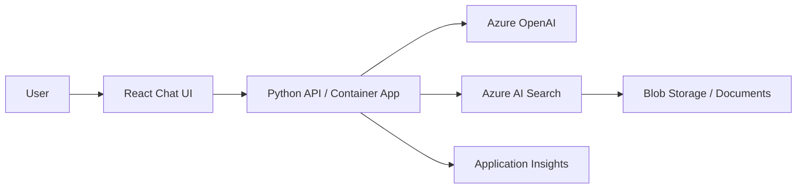

# RAG Chatbot Pattern

## When to Use
User wants: document Q&A, knowledge base, chat with data, PDF/document search, retrieval-augmented generation.

## Architecture



## Azure Services Required

| Service | Purpose | Bicep Module |
|---------|---------|-------------|
| Azure Container Apps | Host the API | `modules/container-apps.bicep` |
| Azure OpenAI | Chat completion + embeddings | `modules/openai.bicep` |
| Azure AI Search | Vector + semantic search | `modules/ai-search.bicep` |
| Azure Blob Storage | Store source documents | `modules/storage.bicep` |
| Application Insights | Monitoring + tracing | `modules/monitoring.bicep` |
| Container Registry | Store Docker images | `modules/container-registry.bicep` |
| Key Vault | Managed secrets | `modules/keyvault.bicep` |

## App Code Structure (Python)

```
src/
├── api/
│   ├── __init__.py
│   ├── app.py                  # Quart app with CORS
│   ├── config.py               # Load env vars
│   ├── routes/
│   │   ├── __init__.py
│   │   ├── chat.py             # POST /chat — main chat endpoint
│   │   └── health.py           # GET /health
│   └── services/
│       ├── __init__.py
│       ├── search_service.py   # Azure AI Search client
│       └── openai_service.py   # Azure OpenAI client
├── Dockerfile
├── requirements.txt
└── gunicorn.conf.py
```

## Key Code Patterns

### Chat endpoint (`routes/chat.py`)
```python
from quart import Blueprint, request, jsonify
from services.search_service import search_documents
from services.openai_service import generate_response

chat_bp = Blueprint("chat", __name__)

@chat_bp.route("/chat", methods=["POST"])
async def chat():
    data = await request.get_json()
    user_message = data.get("message", "")
    
    # 1. Retrieve relevant documents
    search_results = await search_documents(user_message)
    
    # 2. Build context from search results
    context = "\n\n".join([doc["content"] for doc in search_results])
    
    # 3. Generate response with context
    response = await generate_response(user_message, context)
    
    return jsonify({
        "message": response["content"],
        "citations": [{"title": doc["title"], "url": doc["url"]} for doc in search_results]
    })
```

### Search service (`services/search_service.py`)
```python
from azure.identity import DefaultAzureCredential
from azure.search.documents.aio import SearchClient
from config import settings

credential = DefaultAzureCredential()

async def search_documents(query: str, top: int = 5) -> list[dict]:
    async with SearchClient(
        endpoint=settings.search_endpoint,
        index_name=settings.search_index_name,
        credential=credential,
    ) as client:
        results = await client.search(
            search_text=query,
            query_type="semantic",
            semantic_configuration_name="default",
            top=top,
            select=["title", "content", "url"],
        )
        return [doc async for doc in results]
```

### OpenAI service (`services/openai_service.py`)
```python
from azure.identity import DefaultAzureCredential
from openai import AsyncAzureOpenAI
from config import settings

credential = DefaultAzureCredential()

async def generate_response(user_message: str, context: str) -> dict:
    client = AsyncAzureOpenAI(
        azure_endpoint=settings.openai_endpoint,
        azure_ad_token_provider=credential.get_token,
        api_version="2024-12-01-preview",
    )
    
    response = await client.chat.completions.create(
        model=settings.openai_deployment,
        messages=[
            {"role": "system", "content": f"Answer based on this context:\n\n{context}\n\nIf the answer is not in the context, say so."},
            {"role": "user", "content": user_message}
        ],
        temperature=0.7,
        max_tokens=1024,
    )
    
    return {"content": response.choices[0].message.content}
```

### Config (`config.py`)
```python
import os
from dataclasses import dataclass

@dataclass
class Settings:
    # Azure OpenAI
    openai_endpoint: str = os.environ.get("AZURE_OPENAI_ENDPOINT", "")
    openai_deployment: str = os.environ.get("AZURE_OPENAI_DEPLOYMENT", "gpt-4o-mini")
    
    # Azure AI Search  
    search_endpoint: str = os.environ.get("AZURE_SEARCH_ENDPOINT", "")
    search_index_name: str = os.environ.get("AZURE_SEARCH_INDEX_NAME", "documents")
    
    # App config
    app_port: int = int(os.environ.get("PORT", "8000"))

settings = Settings()
```

### Dockerfile
```dockerfile
FROM python:3.11-slim AS base
WORKDIR /app
COPY requirements.txt .
RUN pip install --no-cache-dir -r requirements.txt
COPY . .
EXPOSE 8000
CMD ["gunicorn", "api.app:app", "-c", "gunicorn.conf.py"]
```

### requirements.txt
```
quart>=0.19.0
azure-identity>=1.17.0
azure-search-documents>=11.6.0
openai>=1.40.0
azure-monitor-opentelemetry>=1.6.0
gunicorn>=22.0.0
hypercorn>=0.17.0
```

## azure.yaml for this pattern
```yaml
name: <project-slug>
metadata:
  template: <project-slug>@1.0.0

hooks:
  preprovision:
    posix:
      shell: sh
      run: chmod +x ./scripts/preprovision.sh && ./scripts/preprovision.sh
      interactive: true
      continueOnError: false
    windows:
      shell: pwsh
      run: ./scripts/preprovision.ps1
      interactive: true
      continueOnError: false
  postprovision:
    posix:
      shell: sh
      run: chmod +x ./scripts/postprovision.sh && ./scripts/postprovision.sh
      interactive: true
      continueOnError: true
    windows:
      shell: pwsh
      run: ./scripts/postprovision.ps1
      interactive: true
      continueOnError: true

services:
  api:
    project: ./src
    language: py
    host: containerapp
    docker:
      image: api
      remoteBuild: true
```

## Bicep Specifics

The `infra/main.bicep` for a RAG chatbot MUST create:
1. Resource group
2. Container Apps Environment
3. Container App (the API)
4. Container Registry
5. Azure OpenAI with model deployment (chat + embeddings)
6. Azure AI Search (Basic tier minimum for semantic search)
7. Storage Account with blob container for documents
8. Application Insights + Log Analytics
9. Key Vault
10. Managed Identity with role assignments:
    - `Cognitive Services OpenAI User` on OpenAI resource
    - `Search Index Data Reader` on AI Search resource
    - `Storage Blob Data Reader` on Storage Account

## Postprovision Script

The postprovision script should:
1. Upload sample documents to blob storage (if sample data exists)
2. Create/update the search index with vector configuration
3. Run an initial indexer to populate the search index
4. Print the deployed app URL
