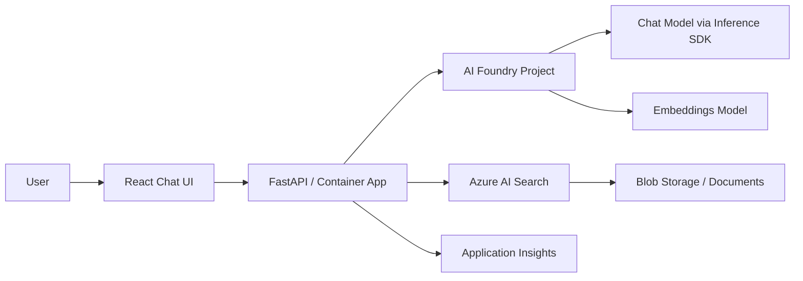

# RAG Chatbot Pattern

## When to Use
User wants: document Q&A, knowledge base, chat with data, PDF/document search, retrieval-augmented generation.

## Architecture



## Azure Services Required

| Service | Purpose | Module |
|---------|---------|--------|
| Azure AI Foundry | AI Services + Project + Models | `core/host/ai-environment.bicep` |
| Azure Container Apps | Host the API + frontend | `core/host/container-apps.bicep` |
| Azure AI Search | Vector + semantic search (conditional) | `core/search/search-services.bicep` |
| Azure Blob Storage | Store source documents | `core/storage/storage-account.bicep` |
| Application Insights | Monitoring + tracing | `core/monitor/applicationinsights.bicep` |
| Container Registry | Store Docker images | (bundled in container-apps module) |
| Log Analytics | Log aggregation | `core/monitor/loganalytics.bicep` |

**Note:** Key Vault is NOT required — this pattern uses Managed Identity exclusively.

## App Code Structure (Python)

```
src/
├── api/
│   ├── __init__.py
│   ├── main.py                 # FastAPI app factory + lifespan (creates clients)
│   ├── routes.py               # Chat endpoint + health + UI serving
│   ├── search_index_manager.py # Azure AI Search client + index management
│   ├── util.py                 # Logger, ChatRequest model
│   ├── data/                   # Sample data + embeddings for RAG
│   │   └── embeddings.csv
│   ├── static/                 # Built React frontend assets
│   └── templates/              # Jinja2 templates (index.html shell)
├── frontend/                   # React chat UI (built into static/ during Docker build)
│   ├── src/
│   ├── package.json
│   └── vite.config.ts
├── Dockerfile
├── requirements.txt
├── gunicorn.conf.py            # Gunicorn config with on_starting hook for index creation
└── __init__.py
```

## Key Code Patterns

### App factory with lifespan (`api/main.py`)

The lifespan pattern creates Azure clients on startup and stores them in `app.state`:

```python
import contextlib
import os
from typing import Union
from urllib.parse import urlparse

import fastapi
from azure.ai.projects.aio import AIProjectClient
from azure.ai.inference.aio import ChatCompletionsClient, EmbeddingsClient
from azure.identity import AzureDeveloperCliCredential, ManagedIdentityCredential
from dotenv import load_dotenv
from fastapi.staticfiles import StaticFiles

from .search_index_manager import SearchIndexManager

@contextlib.asynccontextmanager
async def lifespan(app: fastapi.FastAPI):
    # Choose credential based on environment
    if not os.getenv("RUNNING_IN_PRODUCTION"):
        tenant_id = os.getenv("AZURE_TENANT_ID")
        azure_credential = AzureDeveloperCliCredential(tenant_id=tenant_id) if tenant_id else AzureDeveloperCliCredential()
    else:
        # User-assigned managed identity (client_id set in api.bicep)
        azure_credential = ManagedIdentityCredential(client_id=os.getenv("AZURE_CLIENT_ID"))

    # Connect to AI Foundry Project
    endpoint = os.environ["AZURE_EXISTING_AIPROJECT_ENDPOINT"]
    project = AIProjectClient(credential=azure_credential, endpoint=endpoint)

    # Derive inference endpoint from project endpoint
    # Project:   https://<account>.services.ai.azure.com/api/projects/<project>
    # Inference: https://<account>.services.ai.azure.com/models
    inference_endpoint = f"https://{urlparse(endpoint).netloc}/models"

    chat = ChatCompletionsClient(
        endpoint=inference_endpoint,
        credential=azure_credential,
        credential_scopes=["https://ai.azure.com/.default"],
    )
    embed = EmbeddingsClient(
        endpoint=inference_endpoint,
        credential=azure_credential,
        credential_scopes=["https://ai.azure.com/.default"],
    )

    # Set up RAG search (conditional)
    search_index_manager = None
    search_endpoint = os.environ.get("AZURE_AI_SEARCH_ENDPOINT")
    if search_endpoint and os.getenv("AZURE_AI_SEARCH_INDEX_NAME") and os.getenv("AZURE_AI_EMBED_DEPLOYMENT_NAME"):
        embed_dimensions = int(os.getenv("AZURE_AI_EMBED_DIMENSIONS", "100"))
        search_index_manager = SearchIndexManager(
            endpoint=search_endpoint,
            credential=azure_credential,
            index_name=os.getenv("AZURE_AI_SEARCH_INDEX_NAME"),
            dimensions=embed_dimensions,
            model=os.getenv("AZURE_AI_EMBED_DEPLOYMENT_NAME"),
            embeddings_client=embed,
        )
        await search_index_manager.ensure_index_created(vector_index_dimensions=embed_dimensions)

    # Store clients in app state for dependency injection
    app.state.chat = chat
    app.state.search_index_manager = search_index_manager
    app.state.chat_model = os.environ["AZURE_AI_CHAT_DEPLOYMENT_NAME"]
    yield

    await project.close()
    await chat.close()
    if search_index_manager:
        await search_index_manager.close()


def create_app():
    if not os.getenv("RUNNING_IN_PRODUCTION"):
        load_dotenv(override=True)

    app = fastapi.FastAPI(lifespan=lifespan)
    app.mount("/static", StaticFiles(directory="api/static"), name="static")

    from . import routes
    app.include_router(routes.router)
    return app
```

### Chat endpoint with SSE streaming (`api/routes.py`)

```python
import json
import fastapi
from fastapi import Request, Depends
from fastapi.responses import StreamingResponse
from azure.ai.inference.aio import ChatCompletionsClient
from azure.ai.inference.prompts import PromptTemplate

from .search_index_manager import SearchIndexManager
from .util import ChatRequest

router = fastapi.APIRouter()

def get_chat_client(request: Request) -> ChatCompletionsClient:
    return request.app.state.chat

def get_chat_model(request: Request) -> str:
    return request.app.state.chat_model

def get_search_index_manager(request: Request) -> SearchIndexManager:
    return request.app.state.search_index_manager

@router.post("/chat")
async def chat_stream_handler(
    chat_request: ChatRequest,
    chat_client: ChatCompletionsClient = Depends(get_chat_client),
    model_deployment_name: str = Depends(get_chat_model),
    search_index_manager: SearchIndexManager = Depends(get_search_index_manager),
) -> StreamingResponse:

    async def response_stream():
        messages = [{"role": m.role, "content": m.content} for m in chat_request.messages]

        # Build system prompt — with RAG context if available
        if search_index_manager:
            context = await search_index_manager.search(chat_request)
            if context:
                prompt_messages = PromptTemplate.from_string(
                    "You are a helpful assistant. Answer using this context:\n\n{{context}}"
                ).create_messages(data=dict(context=context))
            else:
                prompt_messages = PromptTemplate.from_string("You are a helpful assistant.").create_messages()
        else:
            prompt_messages = PromptTemplate.from_string("You are a helpful assistant.").create_messages()

        chat_coroutine = await chat_client.complete(
            model=model_deployment_name,
            messages=prompt_messages + messages,
            stream=True,
        )
        async for event in chat_coroutine:
            if event.choices and event.choices[0].delta.content:
                yield f"data: {json.dumps({'content': event.choices[0].delta.content, 'type': 'message'})}\n\n"

        yield f"data: {json.dumps({'type': 'stream_end'})}\n\n"

    return StreamingResponse(response_stream(), headers={
        "Cache-Control": "no-cache",
        "Connection": "keep-alive",
        "Content-Type": "text/event-stream",
    })

@router.get("/health")
async def health():
    return {"status": "healthy"}
```

### Credential pattern summary

| Environment | Credential | How it's set |
|---|---|---|
| Local development | `AzureDeveloperCliCredential` (with optional `tenant_id`) | Developer runs `azd auth login` |
| Production (Container App) | `ManagedIdentityCredential(client_id=...)` | `AZURE_CLIENT_ID` set in api.bicep env vars |
| Gunicorn startup hook | `DefaultAzureCredential` (async) | For one-shot operations like index creation |

### Gunicorn config (`gunicorn.conf.py`)

```python
import asyncio
import os
from azure.identity.aio import DefaultAzureCredential

async def create_index_maybe():
    """Create search index and upload documents on first startup."""
    from api.search_index_manager import SearchIndexManager
    async with DefaultAzureCredential() as creds:
        endpoint = os.environ.get("AZURE_AI_SEARCH_ENDPOINT")
        if endpoint and os.getenv("AZURE_AI_SEARCH_INDEX_NAME"):
            search_mgr = SearchIndexManager(
                endpoint=endpoint,
                credential=creds,
                index_name=os.getenv("AZURE_AI_SEARCH_INDEX_NAME"),
                dimensions=None,
                model=os.getenv("AZURE_AI_EMBED_DEPLOYMENT_NAME"),
                embeddings_client=None,
            )
            if await search_mgr.create_index(
                vector_index_dimensions=int(os.getenv("AZURE_AI_EMBED_DIMENSIONS", "100"))
            ):
                embeddings_path = os.path.join(os.path.dirname(__file__), "api", "data", "embeddings.csv")
                await search_mgr.upload_documents(embeddings_path)
                await search_mgr.close()

def on_starting(server):
    asyncio.get_event_loop().run_until_complete(create_index_maybe())

max_requests = 1000
max_requests_jitter = 50
log_file = "-"
bind = "0.0.0.0:50505"

if not os.getenv("RUNNING_IN_PRODUCTION"):
    reload = True
```

### Dockerfile (Python + React in one container)

```dockerfile
FROM python:3.13-slim-bookworm
WORKDIR /code
COPY . .

RUN pip install --no-cache-dir --upgrade pip && pip install --no-cache-dir -r requirements.txt

# Install Node.js and pnpm, build frontend
RUN apt-get update && apt-get install -y curl \
    && curl -fsSL https://deb.nodesource.com/setup_22.x | bash - \
    && apt-get install -y nodejs && npm install -g pnpm@10.6.0

WORKDIR /code/frontend
RUN pnpm install --frozen-lockfile=false && pnpm build && rm -rf node_modules

WORKDIR /code
EXPOSE 50505
CMD ["gunicorn", "api.main:create_app"]
```

### requirements.txt

```
fastapi>=0.121.0
uvicorn[standard]>=0.29.0
gunicorn>=23.0.0
azure-identity>=1.19.0
azure-ai-projects>=1.0.0
azure-ai-inference>=1.0.0
azure-search-documents>=11.6.0
azure-core>=1.34.0
azure-core-tracing-opentelemetry
azure-monitor-opentelemetry>=1.6.0
opentelemetry-sdk
jinja2
python-dotenv
```

### Environment variables (set by api.bicep)

| Variable | Source | Purpose |
|----------|--------|---------|
| `AZURE_CLIENT_ID` | Managed identity clientId | Auth in production |
| `AZURE_EXISTING_AIPROJECT_ENDPOINT` | AI Project endpoint output | Connect to Foundry |
| `AZURE_AI_CHAT_DEPLOYMENT_NAME` | Bicep param | Chat model name |
| `AZURE_AI_EMBED_DEPLOYMENT_NAME` | Bicep param | Embeddings model (if RAG) |
| `AZURE_AI_EMBED_DIMENSIONS` | Bicep param | Embedding vector size |
| `AZURE_AI_SEARCH_ENDPOINT` | Search service endpoint | RAG search (if enabled) |
| `AZURE_AI_SEARCH_INDEX_NAME` | Bicep param | Search index name (if RAG) |
| `RUNNING_IN_PRODUCTION` | `'true'` | Switch credential type |
| `ENABLE_AZURE_MONITOR_TRACING` | Bicep param | Enable/disable tracing |

## azure.yaml for this pattern

```yaml
name: <project-slug>
metadata:
  template: <project-slug>@1.0.0

requiredVersions:
  azd: ">=1.18.0"

hooks:
  preup:
    posix:
      shell: sh
      run: chmod u+r+x ./scripts/validate_env_vars.sh 2>/dev/null || true; ./scripts/validate_env_vars.sh
      interactive: true
      continueOnError: false
    windows:
      shell: pwsh
      run: ./scripts/validate_env_vars.ps1
      interactive: true
      continueOnError: false
  postdeploy:
    posix:
      shell: sh
      run: chmod u+r+x ./scripts/postdeploy.sh 2>/dev/null || true; ./scripts/postdeploy.sh
      interactive: true
      continueOnError: true
    windows:
      shell: pwsh
      run: ./scripts/postdeploy.ps1
      interactive: true
      continueOnError: true

services:
  api_and_frontend:
    project: ./src
    language: py
    host: containerapp
    docker:
      image: api_and_frontend
      remoteBuild: true

pipeline:
  variables:
    - AZURE_RESOURCE_GROUP
    - AZURE_EXISTING_AIPROJECT_RESOURCE_ID
    - AZURE_AI_CHAT_DEPLOYMENT_NAME
    - AZURE_AI_EMBED_DEPLOYMENT_NAME
    - AZURE_AI_EMBED_DIMENSIONS
    - USE_SEARCH_SERVICE
```

## Bicep Specifics

The `infra/main.bicep` for a RAG chatbot MUST create:
1. Resource group
2. AI Foundry environment (via `core/host/ai-environment.bicep`): Storage + Monitoring + AI Services + Project + Connections + Model deployments
3. Container Apps Environment + Container App + Container Registry
4. Azure AI Search (conditional, `useSearchService` flag)
5. User-assigned managed identity for the Container App
6. Role assignments for BOTH user AND backend identity:
   - `Azure AI Developer` (64702f94)
   - `Cognitive Services User` (a97b65f3)
   - `Azure AI User` (53ca6127) — user only
   - `Search Index Data Contributor` (8ebe5a00) — if search enabled
   - `Search Index Data Reader` (1407120a) — if search enabled
   - `Search Service Contributor` (7ca78c08) — if search enabled
7. AppInsights Monitoring Metrics Contributor scoped to the backend identity
8. Support "bring your own existing project" via `azureExistingAIProjectResourceId`

## Postdeploy Script

1. Print the deployed app URL
2. Print sample questions to try
3. Optionally print Foundry project URL for tracing
